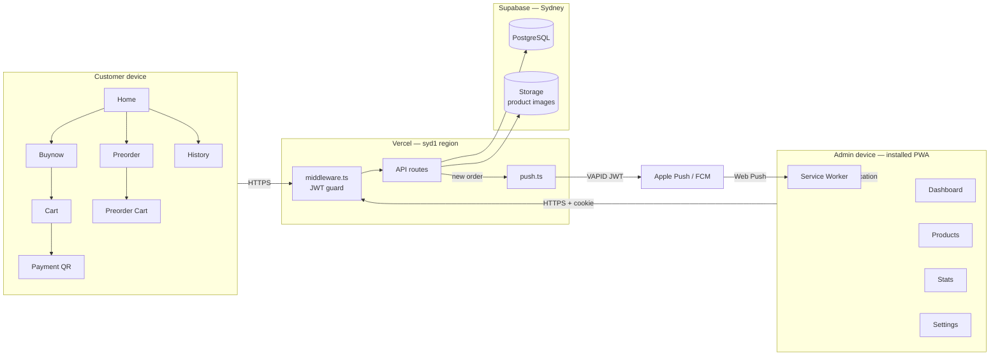
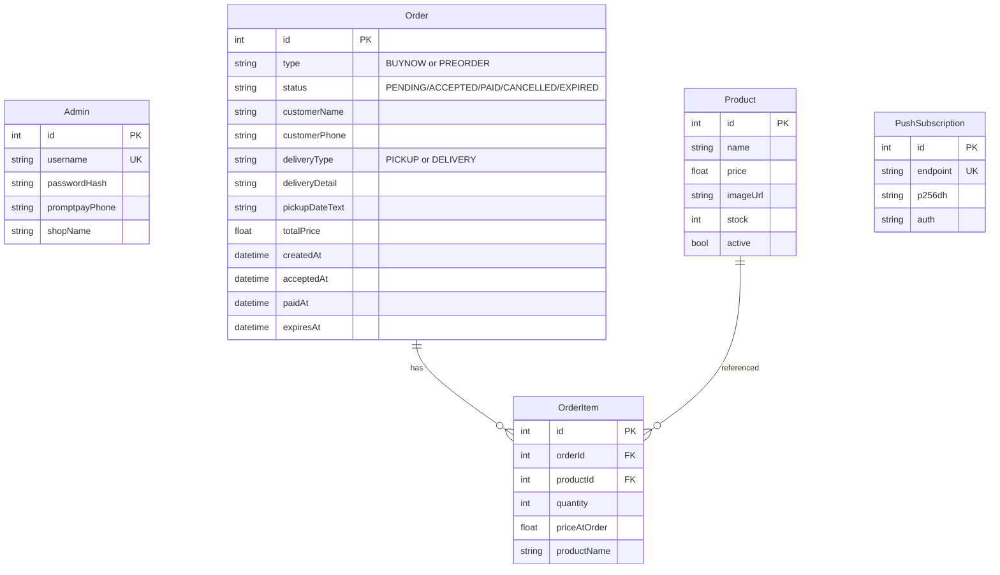
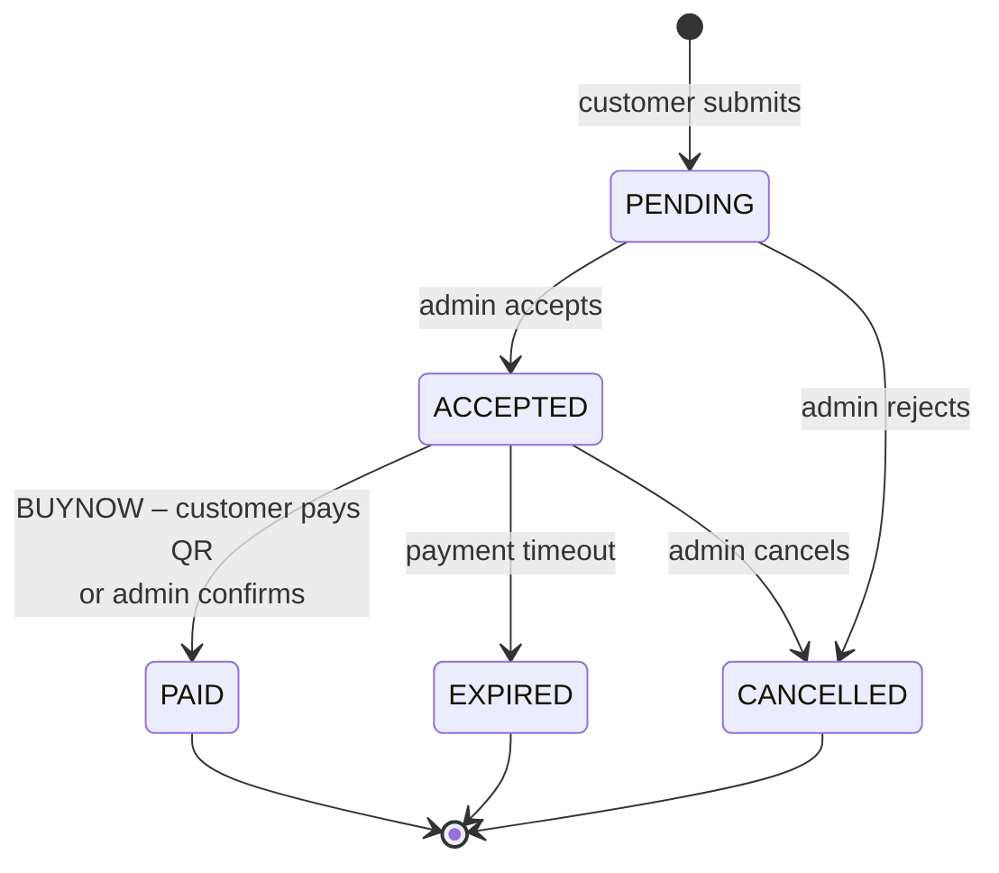

# บ้านขนมจีน — Online Ordering PWA

A Thai-language **Progressive Web App** for a small kanom-jeen (Thai rice noodles)
shop. Customers browse the menu, place either an instant order with on-the-spot
PromptPay payment or a scheduled pre-order, and the owner manages everything
from an installable mobile dashboard with push-notification alerts.

> **Live demo:** https://kanomjeen-bannongbo.vercel.app
> **Course:** CN476 Final Project

---

## Features

### Customer side

- **Two ordering modes**
  - **ซื้อเลย!** — order now, pay immediately via PromptPay QR
  - **สั่งล่วงหน้า** — schedule pickup or delivery, pay on receipt
- Persistent cart per mode (separate carts)
- Installable PWA — works offline-capable, looks native on iOS/Android
- Order history lookup by phone number
- Auto-redirects to payment QR when admin accepts

### Admin side

- Live order dashboard (3-second polling, auto-refresh)
- Web Push notifications for new orders (works on iOS PWA after install)
- In-app "ding" sound when a new order arrives while dashboard is open
- Accept / Cancel / Confirm-payment workflow
- Product CRUD with image upload to Supabase Storage
- Print receipt
- Sales dashboard (today / month revenue, top items)
- Settings: change password, set shop PromptPay phone

### Production-grade backend

- JWT admin auth via httpOnly cookies + Next.js middleware
- Per-IP rate limiting on order create + admin login
- Centralised input validation (size limits, type checks, sanitisation)
- Vercel function region pinned to `syd1` (same as DB)
- Soft-delete for products with order history (FK-safe)

---

## Tech stack

| Layer | Tech |
|---|---|
| Framework | **Next.js 16** (App Router, RSC) + **React 19** |
| Language | **TypeScript** strict mode |
| Styling | **Tailwind CSS 4** |
| State | **Zustand** (persistent carts) |
| Database | **PostgreSQL** on Supabase (Sydney region) |
| ORM | **Prisma 5** |
| Auth | **jose** JWT + bcrypt |
| Push | **web-push** + Service Worker + VAPID |
| Storage | **Supabase Storage** for product images |
| Payment | **promptpay-qr** + **qrcode** generation |
| Hosting | **Vercel** (functions in `syd1`) |

---

## Architecture



### Data model



### Order lifecycle



---

## Local development

```bash
# 1. Install
npm install

# 2. Set up .env (see ENV section below)

# 3. Push schema to your DB + seed default admin/products
npm run db:push
npm run db:seed

# 4. Run dev server
npm run dev
# → http://localhost:3000
```

Default admin login (created by seed):
- username: `admin`
- password: `admin1234`
- **Change immediately in `/admin/settings`**

---

## Environment variables

```bash
# Database
DATABASE_URL="postgresql://...?pgbouncer=true&connection_limit=1"
DIRECT_URL="postgresql://...:5432/postgres"

# Auth (use a long random string in production: openssl rand -base64 64)
ADMIN_JWT_SECRET="..."

# Web Push (generate with: npx web-push generate-vapid-keys)
VAPID_PUBLIC_KEY="B..."
VAPID_PRIVATE_KEY="..."
NEXT_PUBLIC_VAPID_PUBLIC_KEY="B..."   # must equal VAPID_PUBLIC_KEY
VAPID_SUBJECT="https://your-domain.com"  # Apple requires real URL/email — no .local

# Initial admin (only used by seed script)
ADMIN_USERNAME="admin"
ADMIN_PASSWORD="admin1234"
ADMIN_PROMPTPAY_PHONE="0xxxxxxxxx"

# Supabase Storage (for product images)
SUPABASE_URL="https://xxx.supabase.co"
SUPABASE_SERVICE_ROLE_KEY="eyJ..."   # service_role, NOT anon — server only
```

---

## Project structure

```
src/
├── app/
│   ├── api/
│   │   ├── admin/        # Protected by middleware (JWT cookie)
│   │   │   ├── login/
│   │   │   ├── orders/   # accept, cancel, confirm-payment
│   │   │   ├── products/ # CRUD with soft-delete
│   │   │   ├── stats/    # Sales aggregations
│   │   │   ├── upload/   # Image → Supabase Storage
│   │   │   └── ...
│   │   └── orders/
│   │       ├── buynow/   # POST: instant order
│   │       ├── preorder/ # POST: scheduled order
│   │       └── history/  # GET by phone
│   ├── admin/            # Dashboard pages
│   ├── buynow/           # Browse → cart → pay flow
│   ├── preorder/         # Browse → cart → confirm flow
│   ├── cart/             # Buynow checkout
│   ├── history/          # Customer order lookup
│   ├── order/[id]/       # Status / payment / done
│   ├── layout.tsx        # PWA metadata, OG tags
│   └── globals.css
├── lib/
│   ├── auth.ts           # JWT sign/verify
│   ├── db.ts             # Prisma singleton
│   ├── push.ts           # web-push sender
│   ├── storage.ts        # Supabase Storage client
│   ├── validation.ts     # Centralised input validation
│   ├── rateLimit.ts      # In-memory rate limiter
│   ├── cart.ts           # Buynow cart (zustand persist)
│   └── preorderCart.ts   # Preorder cart (zustand persist)
├── components/
│   └── Icon.tsx
└── middleware.ts         # JWT guard for /admin and /api/admin
prisma/
├── schema.prisma
└── seed.ts
public/
├── sw.js                 # Service worker (push handler)
├── manifest.json         # PWA manifest
└── icon-*.png            # PWA icons
```

---

## Security notes

- All `/api/admin/*` routes are guarded by middleware that verifies an
  httpOnly JWT cookie. The cookie is `secure` in production and `sameSite=lax`.
- Admin password is hashed with bcrypt (cost 10).
- Order-create endpoints validate input shape, length, quantity bounds, and
  reject duplicate productIds in one order.
- Rate limiting: order create = 10/min/IP, admin login = 5/5min/IP, history
  lookup = 20/min/IP.
- The `service_role` Supabase key is only ever read in server code (Storage
  upload) — never exposed to the client.
- **Pre-order orders do not check stock** by design (customer commits to wait).

---

## Manual test checklist

- [ ] Place buynow order → admin accepts → pay via QR → marked PAID
- [ ] Place preorder with pickup → admin accepts → no payment screen
- [ ] Order with phone → look up in `/history`
- [ ] Spam 11 orders within a minute → 11th rejected with 429
- [ ] Admin login wrong 6 times → blocked with 429
- [ ] Upload product image (jpg < 2MB) → appears in catalog
- [ ] Upload 5MB image → rejected with size error
- [ ] Delete product that has past orders → soft-deleted (active=false)
- [ ] Admin stats page shows today/month revenue + top items
- [ ] Print receipt → only modal contents visible (nav hidden)
- [ ] On iPhone: install PWA → grant permission → new order → notification arrives

---

## License

Educational project. No commercial license.
